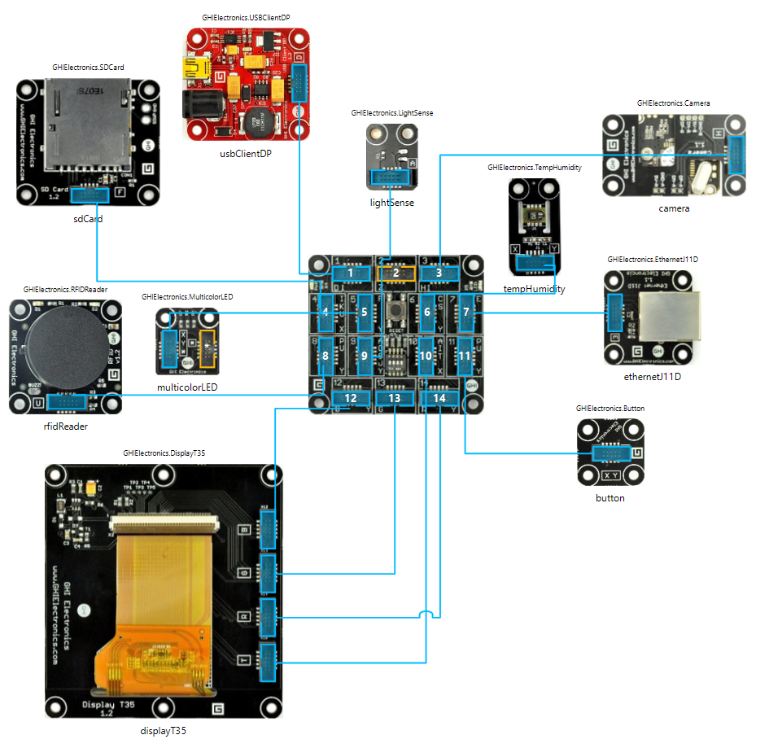
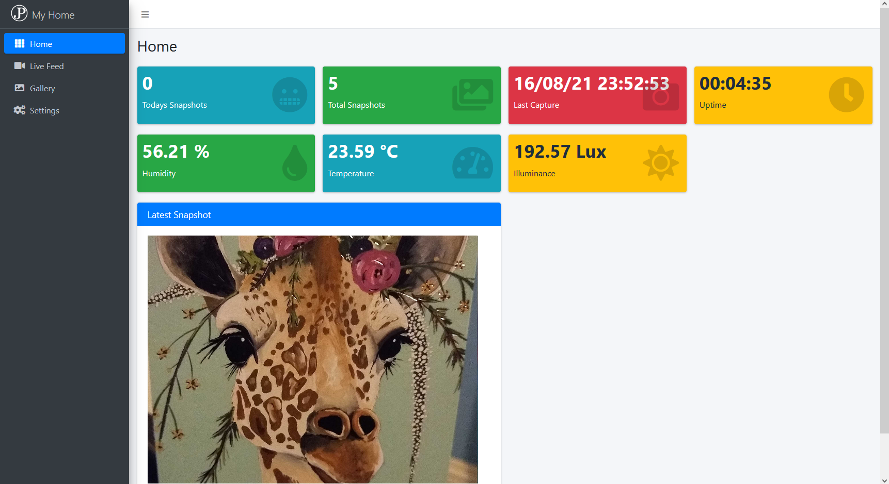
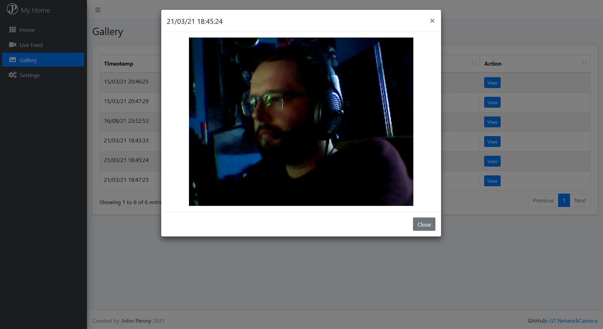
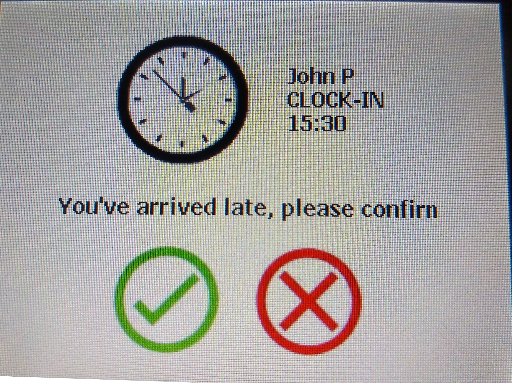
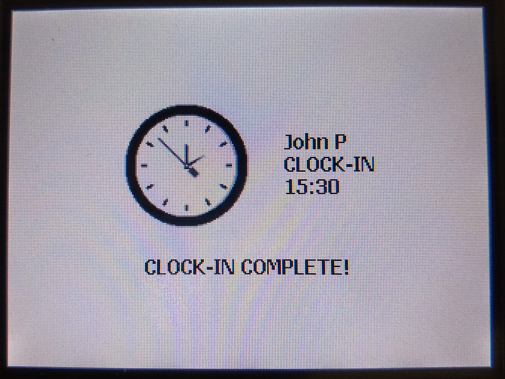
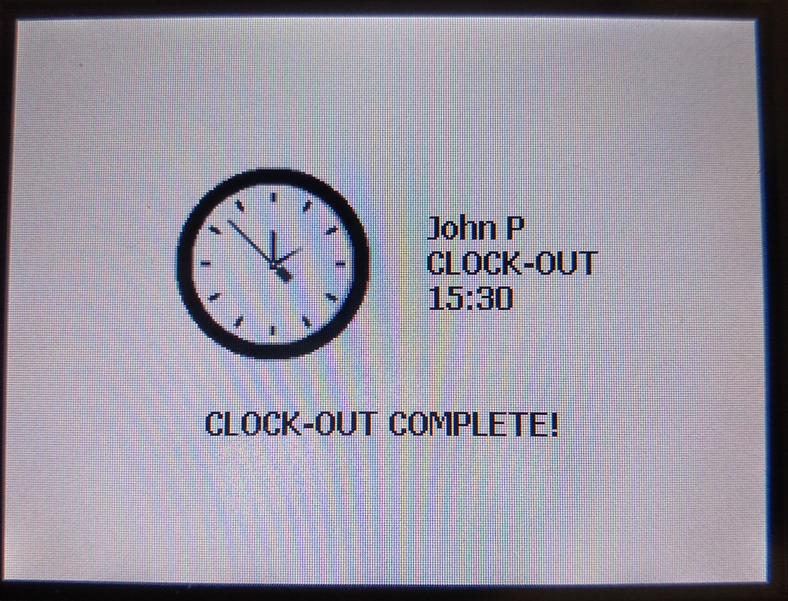

# Gadgeteer Project

It started off as a home network camera using an old electronics kit, and turned into the beginning of a smart home device.

This is written for the Gadgeteer Spider using .Net Micro Framework. The Gadgeteer spider is a now discontinued product by GHI Electronics which I bought in 2013 to use for my dissertation at university.

It uses 2 LEDs and on screen prompts to provide a realtime notification of it's current status. When no-one is around, in the evenings, and over the weekend, the device will switch off the LCD screen and it's LEDs to save power consumption.

It saves light, humidity, and temperature sensor readings to a rolling daily .csv file every 30 seconds. It also takes a picture once every 5 minutes. These features can be enable/disabled for different times of day via a configuration file on the SD card. The device hosts a website stored on an SD card which allows me to remotely access the device from the local network.

Since I had an RFID card reader handing around, I developed a clocking system to record attendance of when you start/end work and go for breaks. Attendance records are logged to a rolling monthly .csv file. New users can be added to the system automatically by simply scanning an unregsitered RFID tag. I'm planning on using this feature in my home office for a bit as a novelty.

## Hardware Diagram

## Web GUI

## GUI on LCD Screen

