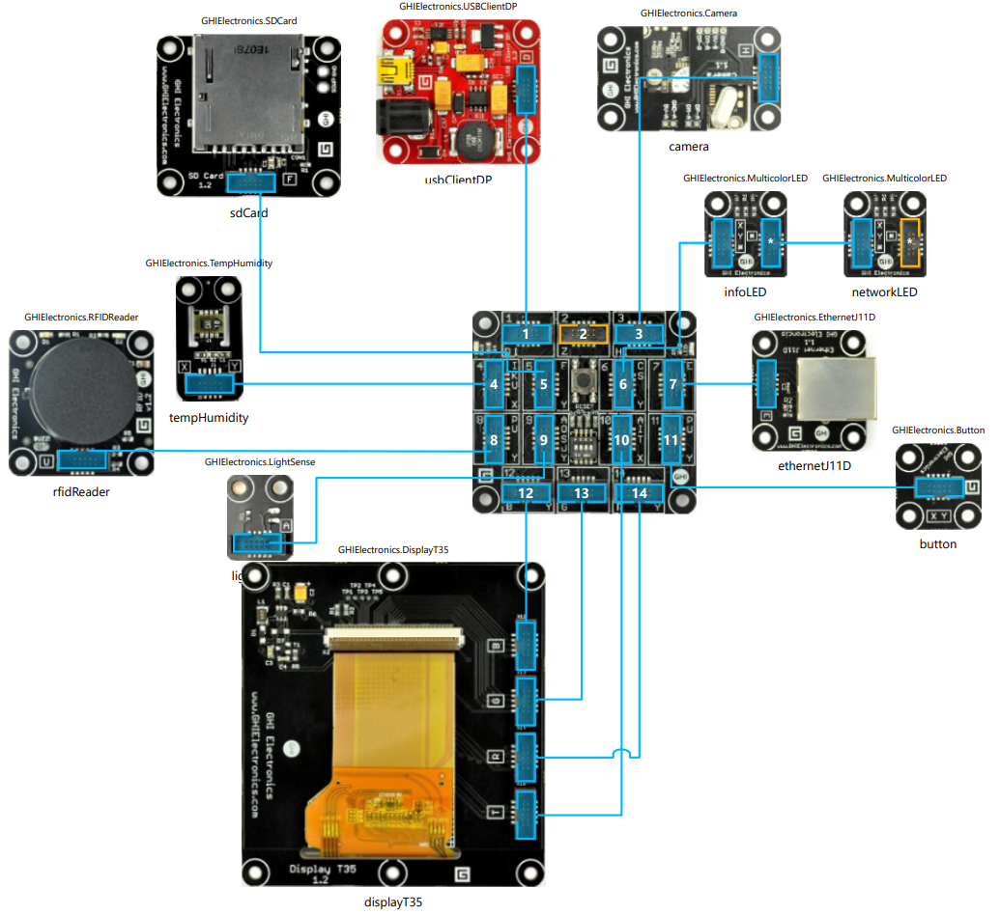

# Gadgeteer Project

It started off as a home network camera using an old electronics kit, and turned into the beginning of a smart home device.

This is written for the Gadgeteer Spider using .Net Micro Framework. The Gadgeteer spider is a now discontinued product by GHI Electronics which I bought in 2013 to use for my dissertation at university.

The device hosts a website stored on an SD card, regularly saves sensor readings, and takes pictures.

I did also connect up an RFID card reader to play around with access control, but I have nothing that I actually need to protect on this build, so it instead writes logs and makes a light flash.

Some parts of this project are overkill, such as;

- Updating the Gadgeteer.WebServer library to return different HTTP status codes
- The JSON serialiser I wrote for the Web API output
- The fluent WPF GUI builder I wrote for the LCD screen
- Workarounds for bugs with the networking and storage devices not working as advertised on startup

## Hardware Diagram

## Web GUI

## GUI on LCD Screen

